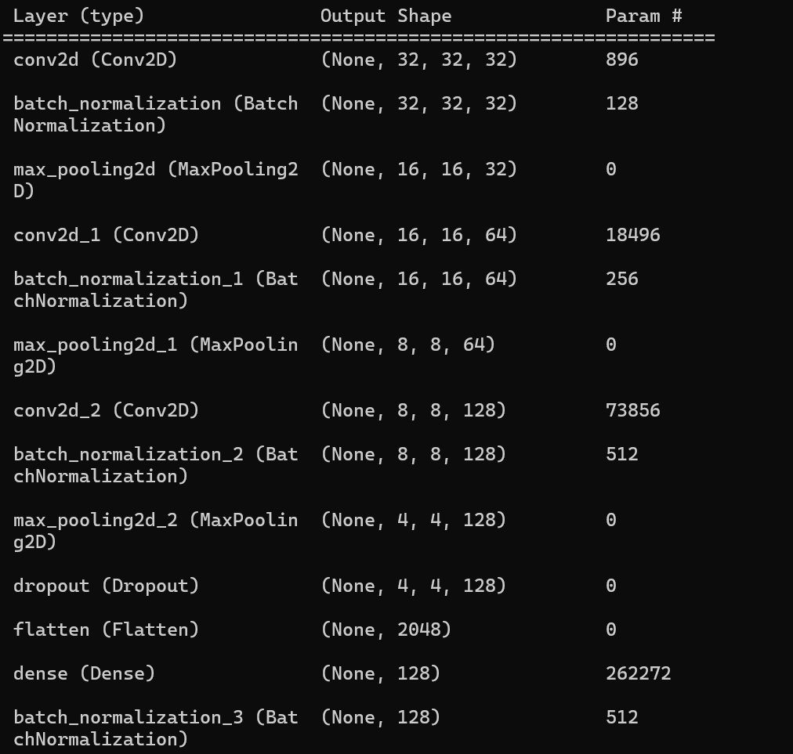
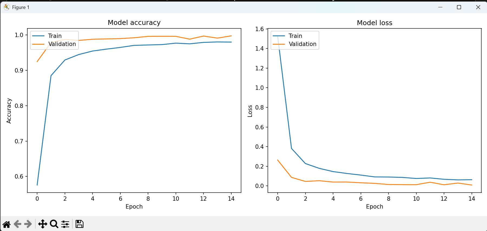
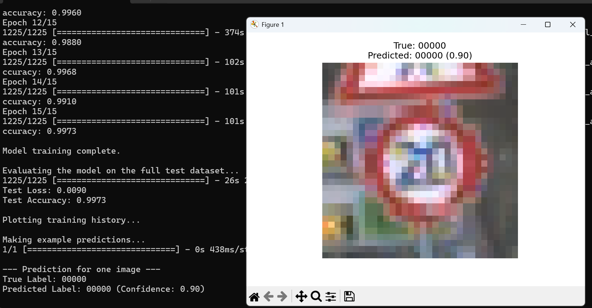

🚦 Automotive Road Sign Recognition using Convolutional Neural Networks (CNN)

Project Overview
Welcome to my deep learning project focused on building a robust Convolutional Neural Network (CNN) for automotive road sign recognition. This project is a foundational step towards understanding the perception systems vital for Advanced Driver-Assistance Systems (ADAS) and autonomous vehicles. Accurate and rapid recognition of road signs is paramount for safe navigation, adherence to traffic laws, and proactive decision-making in real-world driving scenarios.

As an aspiring automotive software engineer, this project allowed me to dive deep into practical machine learning model development, from data preparation and model architecture design to training optimization and performance evaluation.

✨ Key Features
Efficient Image Preprocessing: Utilizes ImageDataGenerator for on-the-fly data loading, resizing, and pixel normalization.

Robust Data Augmentation: Implements various augmentation techniques (rotations, shifts, zooms, shears) to enhance model generalization and prevent overfitting, simulating diverse real-world conditions.

Custom CNN Architecture: A sequential CNN model designed with multiple convolutional layers, batch normalization, max-pooling, and dropout for effective feature extraction and classification.

Performance Monitoring: Integrates Early Stopping and Model Checkpointing to optimize training duration and save the best-performing model based on validation accuracy.

Comprehensive Evaluation: Provides detailed metrics (loss, accuracy) on unseen test data and visual plots of training history.

Example Prediction: Demonstrates real-time inference with confidence scores on a sample image.

🛠️ Technologies Used

Python 3.x
TensorFlow / Keras: For building and training the deep learning model.
NumPy: For numerical operations and data manipulation.
Matplotlib: For visualizing training performance.

📊 Dataset
This project utilizes the renowned German Traffic Sign Recognition Benchmark (GTSRB) dataset. The GTSRB is a large, real-world benchmark dataset that contains over 50,000 images of 43 different traffic sign classes.

Data Format: Images are provided in .ppm format.

Classes: The full dataset comprises 43 distinct classes of road signs (from 00000 to 00042).

To obtain and set up the dataset, please follow these steps:

Download from the Official GTSRB Website:

Visit the official GTSRB website: https://benchmark.ini.rub.de/gtsrb_dataset.html

Download the following files:

GTSRB_Final_Training_Images.zip 
GTSRB_Final_Test_Images.zip 

GTSRB_Final_Test_GT.zip (provides ground truth for the test set, useful for detailed analysis, though ImageDataGenerator will handle labels if images are correctly structured).

Extract the Contents:

Unzip GTSRB_Final_Training_Images.zip. This will create a GTSRB/Final_Training/Images folder. Inside Images, you'll find folders 00000 to 00042.

Unzip GTSRB_Final_Test_Images.zip. This will create a GTSRB/Final_Test/Images folder. Inside Images, you'll find images without class subfolders, but the GTSRB_Final_Test_GT.zip will have a CSV to help organize them.

Organize Your Dataset for this Project:

Create a main folder named road_sign_dataset in the root of your cloned repository.

Inside road_sign_dataset, create two empty subfolders: train and test.

For the train folder:

Copy the 00000 through 00042 subfolders directly from GTSRB/Final_Training/Images into road_sign_dataset/train.

For the test folder:

The raw test data needs to be moved into class-specific subfolders.

Unzip GTSRB_Final_Test_GT.zip. This contains a GT-final_test.csv file.

You'll need a small script (or manual effort) to read this CSV and move each test image from GTSRB/Final_Test/Images into its correct class subfolder (e.g., road_sign_dataset/test/00000/, road_sign_dataset/test/00001/, etc.). A simple Python script for this can be found online or created if needed.

Important: If manually organizing, ensure you create all 43 class subfolders (00000 to 00042) inside road_sign_dataset/test/ before moving images.

Your final directory structure should look exactly like this:

road-sign-recognition-cnn/
├── road_sign_dataset/      # <--- Your processed dataset goes here
│   ├── train/              # Contains subfolders 00000 to 00042 with training images
│   │   ├── 00000/
│   │   ├── 00001/
│   │   └── ... (up to 00042)
│   └── test/               # Contains subfolders 00000 to 00042 with test images
│       ├── 00000/
│       ├── 00001/
│       └── ... (up to 00042)
├── road_sign_classifier.py
├── README.md

🧠 Model Architecture
The CNN architecture is a Sequential model comprising:

Convolutional Blocks: Three sets of Conv2D layers (32, 64, 128 filters respectively) with ReLU activation and BatchNormalization for stable learning, followed by MaxPooling2D for dimensionality reduction and feature summarization.

Dropout Layers: Applied after the last convolutional block (0.25 rate) and after the first dense layer (0.5 rate) to mitigate overfitting.

Flatten Layer: Converts the 2D feature maps into a 1D vector.

Dense Layers: A hidden Dense layer with 128 units (ReLU activation) and a final Dense output layer with NUM_CLASSES (43) units and softmax activation for multi-class probability distribution.

Model: "sequential"
**Model: "sequential"**

*Caption: The dense_1 layer's Param # will be larger when NUM_CLASSES is 43, indicating connections to 43 output neurons instead of 2*

🚀 Performance (Full 43 Classes)
Upon training with the complete GTSRB dataset, the model demonstrated robust performance:

Test Loss: [0.0090]

Test Accuracy: [0.9973]

This high accuracy underscores the effectiveness of the CNN architecture and data augmentation strategies in learning intricate features of various road signs.

📦 Getting Started (Usage)
To set up and run this project locally, follow these steps:

Clone the Repository then

Download and Organize the GTSRB Dataset: (See detailed instructions in the "📊 Dataset" section above). Ensure your road_sign_dataset folder contains train and test subfolders, each with 43 class-specific directories (00000 to 00042) filled with .ppm images.

Install Dependencies then

Run the Training Script:

python road_sign_classifier.py

The script will load data, build the model, start training, display performance plots, and save the best-performing model as road_sign_cnn_model.h5.

📂 Project Structure
.
├── road_sign_dataset/      # Your road sign images go here (after extraction and organization)
│   ├── train/              # Training images per class (00000 to 00042)
│   └── test/               # Test images per class (00000 to 00042)
├── road_sign_classifier.py # Main Python script for model training and evaluation
├── requirements.txt        # Python dependencies
├── best_road_sign_model.h5 # Saved model (best during training)
├── road_sign_cnn_model.h5  # Final saved model
└── README.md               # This documentation

📈 Results
Here's a visual representation of the model's training performance:

**Model Accuracy & Loss over Epochs:**

*Caption: Training and Validation Accuracy & Loss progression over epochs.*

**Example Prediction:**

*Caption: An example prediction showcasing the model correctly classifying a road sign with high confidence.*

Thank you for visiting my project!
